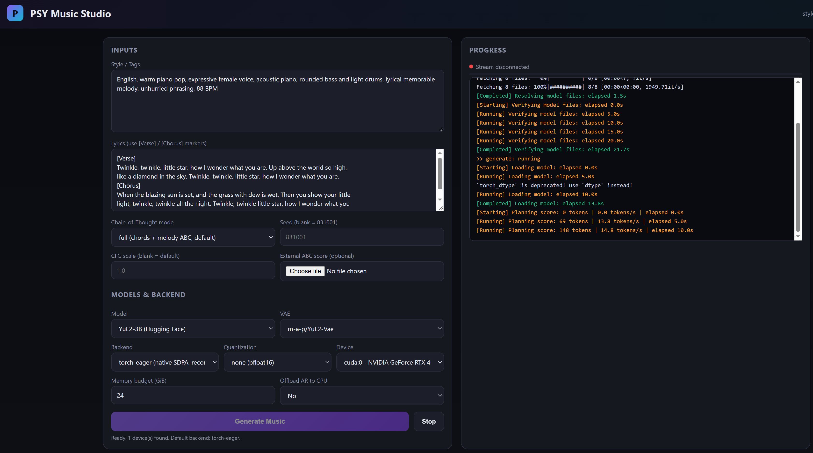

<p align="center">
  
</p>

<h1 align="center">PSY Music Studio</h1>

<p align="center">
  A browser-based studio for AI song generation, built on top of the
  <a href="https://github.com/multimodal-art-projection/YuE">YuE2</a> pipeline.
  Pick a model, enter style + lyrics, watch live progress, and play, download,
  or open the generated song directly from the UI.
</p>

<p align="center">
  
</p>

<p align="center">
  <a href="#installation">Installation</a> ·
  <a href="#usage">Usage</a> ·
  <a href="#features">Features</a> ·
  <a href="#credits--license">Credits</a>
</p>

---

## Overview

**PSY Music Studio** is a single-file FastAPI web UI that wraps the
[YuE2](https://github.com/multimodal-art-projection/YuE) song-generation pipeline.
YuE2 is a *style + lyrics → symbolic plan → song* model developed by the
Multimodal Art Projection (m-a-p) team. This repo packages that pipeline behind
a friendly browser interface so you can:

- Choose model / VAE / backend / quantization / device from dropdowns,
- Enter a music style and lyrics (with `[Verse]` / `[Chorus]` markers),
- Watch the resolve → verify → load → plan → generate → synthesize → decode
  pipeline stream progress in real time,
- Play the result inside the page, download it as `.flac`, or open its
  containing folder.

The full YuE2 source is included verbatim under [`src/yue2`](./src/yue2). No
upstream code is modified; this repo only adds the WebUI launcher and a few
convenience scripts.

## Features

- **No build step** — one `webui.py` file, vanilla HTML/CSS/JS.
- **Live progress** via Server-Sent Events; every `[YuE2] ...` stderr line is
  shown in the UI with a status pill and a progress bar.
- **Inline audio player**, plus Download `.flac` and Open-containing-folder
  buttons.
- **Auto-discovery** of cached Hugging Face models and CUDA devices.
- **Backend selector**: `torch-eager` (native SDPA, works without flash-attn),
  `torch` (CUDA graphs + flash), or `vllm`.
- **One-click launchers** for Windows (`run.bat`) and Linux/macOS (`run.sh`)
  that auto-detect your venv and open the browser.
- **Windows-safe**: uses the Selector event loop to avoid cosmetic
  `WinError 10054` connection-reset noise from SSE clients.

## Example: Twinkle Twinkle, Little Star

Below is a complete example using the classic nursery rhyme. Both versions
were generated with PSY Music Studio using the same lyrics but different
vocal styles. Click play to hear them right in the README.

**Lyrics used:**

```
[Verse]
Twinkle, twinkle, little star, how I wonder what you are.
Up above the world so high, like a diamond in the sky.
Twinkle, twinkle, little star, how I wonder what you are.

[Chorus]
When the blazing sun is set, and the grass with dew is wet.
Then you show your little light, twinkle, twinkle all the night.
Twinkle, twinkle little star, how I wonder what you are.
```

### Male vocal version

> Style: `English, male voice, pop, acoustic piano, light drums, warm, heartfelt, 88 BPM`

<audio controls style="width:100%">
  <source src="assests/male.flac" type="audio/flac">
</audio>

[⬇ Download male.flac](./assests/male.flac) (14 MB)

### Female vocal version

> Style: `English, female voice, pop, acoustic piano, light drums, warm, lyrical melody, 88 BPM`

<audio controls style="width:100%">
  <source src="assests/female.flac" type="audio/flac">
</audio>

[⬇ Download female.flac](./assests/female.flac) (13.2 MB)

## Installation

You need **Python 3.10+** and (optionally, but strongly recommended) an
**NVIDIA CUDA GPU** with ≥ 12 GiB VRAM. CPU-only works but is extremely slow.

### 1. Clone

```bash
git clone https://github.com/pyshine-labs/psy.git
cd psy
```

### 2. Create a virtual environment

```powershell
# Windows (PowerShell)
python -m venv .venv
.\.venv\Scripts\Activate.ps1
```

```bash
# Linux / macOS
python -m venv .venv
source .venv/bin/activate
```

### 3. Install YuE2 + this WebUI

```bash
pip install -e .
```

This installs the `yue2` package (and its dependencies: `torch`, `transformers`,
`safetensors`, `soundfile`, `tiktoken`, …) from the bundled source under
`src/yue2`.

### 4. Install a CUDA-enabled PyTorch (GPU users)

The `pip install -e .` step installs the CPU-only torch wheel by default.
To use your NVIDIA GPU, replace it with a matching CUDA build:

```bash
# Example: torch 2.10 + CUDA 12.6 (Windows, Python 3.12)
pip install --force-reinstall --no-deps \
    torch==2.10.0+cu126 \
    torchvision==0.25.0+cu126 \
    torchaudio==2.10.0+cu126 \
    --index-url https://download.pytorch.org/whl/cu126
```

Pick the index URL that matches your driver's CUDA version:

| CUDA | Index URL |
|------|-----------|
| 12.6 | `https://download.pytorch.org/whl/cu126` |
| 12.4 | `https://download.pytorch.org/whl/cu124` |
| 12.1 | `https://download.pytorch.org/whl/cu121` |

> ⚠️ If you see `USE_FLASH_ATTENTION was not enabled for build`, your torch
> wheel was not compiled with flash-attention. Use the **`torch-eager`**
> backend in the WebUI — it falls back to PyTorch's native SDPA kernel and
> works on every CUDA torch build.

### 5. Install FastAPI + Uvicorn (the WebUI server)

```bash
pip install fastapi uvicorn
```

> (These are the only two extra dependencies the WebUI adds on top of YuE2.)

## Usage

### One-click launch

```powershell
# Windows
.\run.bat
```

```bash
# Linux / macOS
./run.sh
```

The launcher auto-detects your venv, starts the server, and opens your browser
at <http://127.0.0.1:7860>.

### Manual launch

```bash
python webui.py
# or with custom host/port
python webui.py --host 0.0.0.0 --port 8000
```

### In the browser

1. **Inputs** panel — edit the Style/Tags and Lyrics textareas. Use
   `[Verse]` / `[Chorus]` markers; YuE2 understands them.
2. **Models & Backend** panel — pick a Model, VAE, Backend, Quantization,
   Device, and Memory budget. On a single-GPU Windows machine the defaults
   (`m-a-p/YuE2-3B`, `torch-eager`, `cuda:0`, 24 GiB) are usually correct.
3. Click **Generate Music**. The Progress panel streams every pipeline stage
   (Resolving → Verifying → Loading → Planning score → Generating song →
   Synthesizing audio → Loading audio decoder → Decoding audio).
4. When it finishes, the Result panel appears with:
   - an inline `<audio>` player,
   - **Download .flac**,
   - **Open containing folder** (highlights the generated `audio.flac` in
     Explorer/Finder/your file manager).

### Command-line (original YuE2 CLI)

The original `yue2` CLI still works:

```bash
yue2 generate --output runs/my-song --style "English, warm piano pop" \
    --lyrics "[Verse]\nHello world"
```

See `examples/README.md` for the example lyrics request format.

## Repository layout

```
psy/
├── webui.py              # PSY Music Studio WebUI (FastAPI + SSE)
├── run.bat               # Windows launcher
├── run.sh                # Linux/macOS launcher
├── examples/             # Original YuE2 example lyrics + generate.py
├── src/yue2/             # Unmodified YuE2 package (cli, pipeline, models)
├── tests/                # YuE2 test suite
├── docs/                 # YuE2 documentation
├── skills/               # YuE2 skill / agent definitions
├── assets/               # Logo + architecture images
├── assests/              # Demo audio (male.flac, female.flac) for README
├── licenses/             # Third-party license texts
├── pyproject.toml        # Installs the bundled yue2 package
├── LICENSE               # Apache 2.0 (inherited from YuE2)
├── MODEL_LICENSE         # Model weight license
└── THIRD_PARTY_NOTICES.md
```

## Credits & License

**PSY Music Studio** is a thin web wrapper authored by
[Pyshine Labs](https://github.com/pyshine-labs). All of the actual
song-generation intelligence — the model, the symbolic-plan + codec-token
pipeline, the VAE, and the sampling code under `src/yue2/` — is the work of
the **YuE2 / Multimodal Art Projection (m-a-p)** team:

- **YuE2 upstream:** <https://github.com/multimodal-art-projection/YuE>
- **YuE2 models on Hugging Face:**
  - <https://huggingface.co/m-a-p/YuE2-3B>
  - <https://huggingface.co/m-a-p/YuE2-Vae>

If you use PSY Music Studio in research or product work, please cite the
YuE2 model and the m-a-p team as the source of the generation pipeline.

## Troubleshooting

| Symptom | Fix |
|---|---|
| `Torch not compiled with CUDA enabled` | Install a `+cuXXX` torch wheel (see Installation §4). |
| `USE_FLASH_ATTENTION was not enabled for build` | Switch backend to `torch-eager` in the WebUI. |
| `backend must be torch, torch-eager, or vllm` | Refresh the page (stale dropdown) and pick a backend value. |
| `ConnectionResetError [WinError 10054]` in console | Cosmetic only — already handled by the Selector event loop in `webui.py`. Generation still succeeds. |
| First Generate is very slow | Model weights download (~6 GiB) and are cached. Subsequent runs skip the download. |
